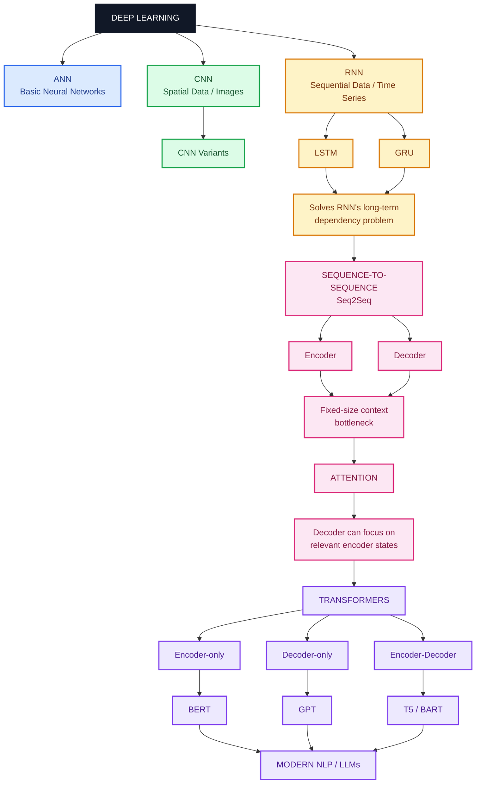

```mermaid
flowchart TD
    DL[DEEP LEARNING]

    DL --> ANN[ANN<br/>Basic Neural Networks]
    DL --> CNN[CNN<br/>Spatial Data / Images]
    DL --> RNN[RNN<br/>Sequential Data / Time Series]

    CNN --> CNNV[CNN Variants]

    RNN --> LSTM[LSTM]
    RNN --> GRU[GRU]
    LSTM --> LTD[Solves RNN's long-term<br/>dependency problem]
    GRU --> LTD

    LTD --> S2S[SEQUENCE-TO-SEQUENCE<br/>Seq2Seq]

    S2S --> ENC[Encoder]
    S2S --> DEC[Decoder]
    ENC --> BOT[Fixed-size context<br/>bottleneck]
    DEC --> BOT

    BOT --> ATT[ATTENTION]
    ATT --> ATTD[Decoder can focus on<br/>relevant encoder states]

    ATTD --> TRANS[TRANSFORMERS]

    TRANS --> EO[Encoder-only]
    TRANS --> DO[Decoder-only]
    TRANS --> ED[Encoder-Decoder]

    EO --> BERT[BERT]
    DO --> GPT[GPT]
    ED --> T5[T5 / BART]

    BERT --> LLM[MODERN NLP / LLMs]
    GPT --> LLM
    T5 --> LLM

    classDef annStyle fill:#dbeafe,stroke:#2563eb,stroke-width:2px,color:#1e3a8a
    classDef cnnStyle fill:#dcfce7,stroke:#16a34a,stroke-width:2px,color:#14532d
    classDef rnnStyle fill:#fef3c7,stroke:#d97706,stroke-width:2px,color:#78350f
    classDef seq2seqStyle fill:#fce7f3,stroke:#db2777,stroke-width:2px,color:#831843
    classDef transformerStyle fill:#ede9fe,stroke:#7c3aed,stroke-width:2px,color:#4c1d95
    classDef rootStyle fill:#111827,stroke:#111827,stroke-width:2px,color:#ffffff

    class DL rootStyle
    class ANN annStyle
    class CNN,CNNV cnnStyle
    class RNN,LSTM,GRU,LTD rnnStyle
    class S2S,ENC,DEC,BOT,ATT,ATTD seq2seqStyle
    class TRANS,EO,DO,ED,BERT,GPT,T5,LLM transformerStyle
```
