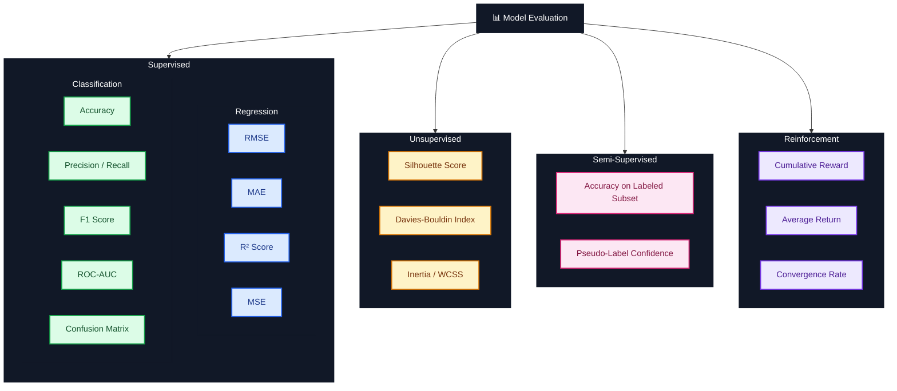

```mermaid
flowchart TD
    START["📊 Model Evaluation"]

    START --> EVSUP
    START --> EVUNS
    START --> EVSEMI
    START --> EVRL

    subgraph EVSUP["Supervised"]
        direction TB
        subgraph EVREG["Regression"]
            direction LR
            H4["RMSE"]
            H4B["MAE"]
            H4C["R² Score"]
            H4D["MSE"]
        end
        subgraph EVCLF["Classification"]
            direction LR
            H1["Accuracy"]
            H2["Precision / Recall"]
            H3["F1 Score"]
            H5["ROC-AUC"]
            H6["Confusion Matrix"]
        end
    end

    subgraph EVUNS["Unsupervised"]
        direction LR
        U1["Silhouette Score"]
        U2["Davies-Bouldin Index"]
        U3["Inertia / WCSS"]
    end

    subgraph EVSEMI["Semi-Supervised"]
        direction LR
        SM1["Accuracy on Labeled Subset"]
        SM2["Pseudo-Label Confidence"]
    end

    subgraph EVRL["Reinforcement"]
        direction LR
        RLE1["Cumulative Reward"]
        RLE2["Average Return"]
        RLE3["Convergence Rate"]
    end

    classDef rootStyle fill:#111827,stroke:#111827,stroke-width:2px,color:#ffffff
    classDef regStyle fill:#dbeafe,stroke:#2563eb,stroke-width:2px,color:#1e3a8a
    classDef clfStyle fill:#dcfce7,stroke:#16a34a,stroke-width:2px,color:#14532d
    classDef unsStyle fill:#fef3c7,stroke:#d97706,stroke-width:2px,color:#78350f
    classDef semiStyle fill:#fce7f3,stroke:#db2777,stroke-width:2px,color:#831843
    classDef rlStyle fill:#ede9fe,stroke:#7c3aed,stroke-width:2px,color:#4c1d95
    classDef subgraphStyle fill:#111827,stroke:#111827,stroke-width:2px,color:#ffffff

    class START rootStyle

    class H4,H4B,H4C,H4D regStyle
    class H1,H2,H3,H5,H6 clfStyle
    class U1,U2,U3 unsStyle
    class SM1,SM2 semiStyle
    class RLE1,RLE2,RLE3 rlStyle

    class EVSUP,EVREG,EVCLF,EVUNS,EVSEMI,EVRL subgraphStyle
```
