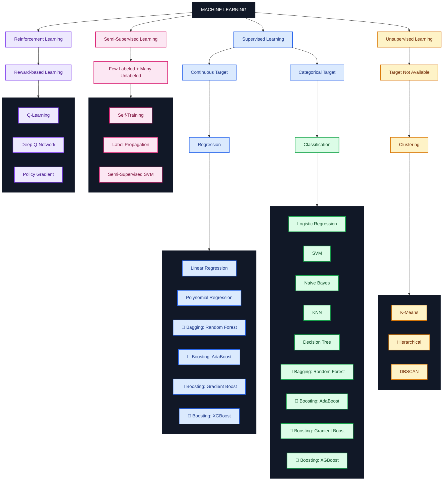

```mermaid
flowchart TD
    START["MACHINE LEARNING"]

    START --> SUP["Supervised Learning"]
    START --> UNSL["Unsupervised Learning"]
    START --> SEMI["Semi-Supervised Learning"]
    START --> RL["Reinforcement Learning"]

    SUP --> CONT["Continuous Target"]
    SUP --> CAT["Categorical Target"]
    UNSL --> TNA["Target Not Available"]
    SEMI --> SNA["Few Labeled + Many Unlabeled"]
    RL --> RNA["Reward-based Learning"]

    CONT --> REG["Regression"]
    CAT --> CLF["Classification"]
    TNA --> CLU["Clustering"]
    SNA --> SEMIA
    RNA --> RLA
    REG --> REGA
    CLF --> CLFA
    CLU --> CLUA

    subgraph REGA[" "]
        direction LR
        RG1["Linear Regression"]
        RG2["Polynomial Regression"]
        RG3["🎒 Bagging: Random Forest"]
        RG4["🚀 Boosting: AdaBoost"]
        RG5["🚀 Boosting: Gradient Boost"]
        RG6["🚀 Boosting: XGBoost"]
    end

    subgraph CLFA[" "]
        direction LR
        CF1["Logistic Regression"]
        CF2["SVM"]
        CF3["Naive Bayes"]
        CF4["KNN"]
        CF5["Decision Tree"]
        CF6["🎒 Bagging: Random Forest"]
        CF7["🚀 Boosting: AdaBoost"]
        CF8["🚀 Boosting: Gradient Boost"]
        CF9["🚀 Boosting: XGBoost"]
    end

    subgraph CLUA[" "]
        direction LR
        CL1["K-Means"]
        CL2["Hierarchical"]
        CL3["DBSCAN"]
    end

    subgraph SEMIA[" "]
        direction LR
        S1["Self-Training"]
        S2["Label Propagation"]
        S3["Semi-Supervised SVM"]
    end

    subgraph RLA[" "]
        direction LR
        RE1["Q-Learning"]
        RE2["Deep Q-Network"]
        RE3["Policy Gradient"]
    end

    classDef rootStyle fill:#111827,stroke:#111827,stroke-width:2px,color:#ffffff
    classDef regStyle fill:#dbeafe,stroke:#2563eb,stroke-width:2px,color:#1e3a8a
    classDef clfStyle fill:#dcfce7,stroke:#16a34a,stroke-width:2px,color:#14532d
    classDef cluStyle fill:#fef3c7,stroke:#d97706,stroke-width:2px,color:#78350f
    classDef semiStyle fill:#fce7f3,stroke:#db2777,stroke-width:2px,color:#831843
    classDef rlStyle fill:#ede9fe,stroke:#7c3aed,stroke-width:2px,color:#4c1d95
    classDef subgraphStyle fill:#111827,stroke:#111827,stroke-width:2px,color:#ffffff

    class START rootStyle
    class SUP,CONT,CAT,REG,RG1,RG2,RG3,RG4,RG5,RG6 regStyle
    class CLF,CF1,CF2,CF3,CF4,CF5,CF6,CF7,CF8,CF9 clfStyle
    class UNSL,TNA,CLU,CL1,CL2,CL3 cluStyle
    class SEMI,SNA,S1,S2,S3 semiStyle
    class RL,RNA,RE1,RE2,RE3 rlStyle
    class REGA,CLFA,CLUA,SEMIA,RLA subgraphStyle
```
