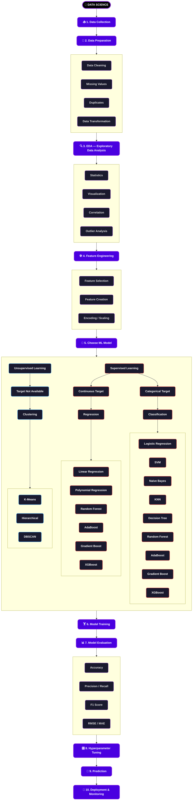

 

## 🗺️ The Pipeline

```mermaid
flowchart TD
    A(["🧬 DATA SCIENCE"]) --> B["📥 1. Data Collection"]
    B --> C["🧹 2. Data Preparation"]

    subgraph PREP[" "]
        direction LR
        C1["Data Cleaning"]
        C2["Missing Values"]
        C3["Duplicates"]
        C4["Data Transformation"]
    end
    C --> PREP

    PREP --> D["🔍 3. EDA — Exploratory Data Analysis"]

    subgraph EDA[" "]
        direction LR
        D1["Statistics"]
        D2["Visualization"]
        D3["Correlation"]
        D4["Outlier Analysis"]
    end
    D --> EDA

    EDA --> E["🛠️ 4. Feature Engineering"]

    subgraph FE[" "]
        direction LR
        E1["Feature Selection"]
        E2["Feature Creation"]
        E3["Encoding / Scaling"]
    end
    E --> FE

    FE --> F["🤖 5. Choose ML Model"]

    subgraph MODEL[" "]
        direction TB

        SUP["Supervised Learning"]
        UNS["Unsupervised Learning"]

        SUP --> CONT["Continuous Target"]
        SUP --> CAT["Categorical Target"]
        UNS --> TNA["Target Not Available"]

        CONT --> REG["Regression"]
        CAT --> CLF["Classification"]
        TNA --> CLU["Clustering"]

        subgraph REGA[" "]
            direction LR
            RG1["Linear Regression"]
            RG2["Polynomial Regression"]
            RG3["Random Forest"]
            RG4["AdaBoost"]
            RG5["Gradient Boost"]
            RG6["XGBoost"]
        end
        REG --> REGA

        subgraph CLFA[" "]
            direction LR
            CF1["Logistic Regression"]
            CF2["SVM"]
            CF3["Naive Bayes"]
            CF4["KNN"]
            CF5["Decision Tree"]
            CF6["Random Forest"]
            CF7["AdaBoost"]
            CF8["Gradient Boost"]
            CF9["XGBoost"]
        end
        CLF --> CLFA

        subgraph CLUA[" "]
            direction LR
            CL1["K-Means"]
            CL2["Hierarchical"]
            CL3["DBSCAN"]
        end
        CLU --> CLUA
    end
    F --> MODEL

    MODEL --> G["🏋️ 6. Model Training"]
    G --> H["📊 7. Model Evaluation"]

    subgraph EVAL[" "]
        direction LR
        H1["Accuracy"]
        H2["Precision / Recall"]
        H3["F1 Score"]
        H4["RMSE / MAE"]
    end
    H --> EVAL

    EVAL --> I["🎛️ 8. Hyperparameter Tuning"]
    I --> J["🔮 9. Prediction"]
    J --> K["🚀 10. Deployment & Monitoring"]

    classDef stage fill:#4A00E0,stroke:#8E2DE2,stroke-width:2px,color:#fff,font-weight:bold,rx:10,ry:10
    classDef sub fill:#1a1a2e,stroke:#8E2DE2,stroke-width:1px,color:#e0e0e0,rx:6,ry:6
    classDef root fill:#000,stroke:#8E2DE2,stroke-width:3px,color:#fff,font-weight:bold,rx:20,ry:20
    classDef supervised fill:#1a1a2e,stroke:#E53935,stroke-width:1.5px,color:#fff,rx:6,ry:6
    classDef unsupervised fill:#1a1a2e,stroke:#1E88E5,stroke-width:1.5px,color:#fff,rx:6,ry:6

    class A root
    class B,C,D,E,F,G,H,I,J,K stage
    class C1,C2,C3,C4,D1,D2,D3,D4,E1,E2,E3,H1,H2,H3,H4 sub
    class SUP,CONT,CAT,REG,RG1,RG2,RG3,RG4,RG5,RG6,CLF,CF1,CF2,CF3,CF4,CF5,CF6,CF7,CF8,CF9 supervised
    class UNS,TNA,CLU,CL1,CL2,CL3 unsupervised
```

 

 

⭐ If this map helped map out your own DS journey, consider starring the repo.

